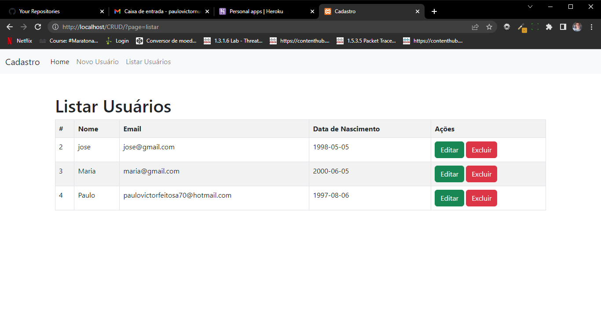

# ClickEvloue 
 ## Descrição 
  - Neste simples projeto, criei um site de cadastro de usuários. Para o estilo eu usei o bootstrap, pois acho mais usa-lo na estilização de tabelas.
 
 ### Link
 - Live Site URL: [https://appcadastro22.herokuapp.com/index.php](https://appcadastro22.herokuapp.com/index.php)
  
### Tela Inicial 

### Tela de cadastro

### Tela de listagem onde se pode escolher aonde irá editar ou excluir

### Tela de atualizar cadastro

